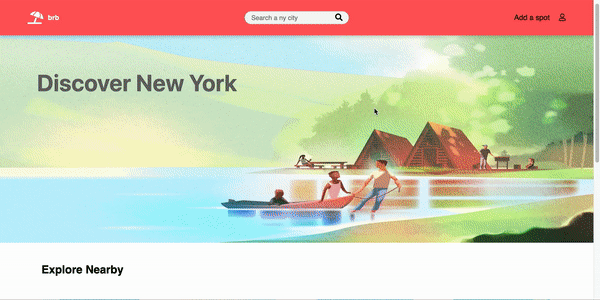
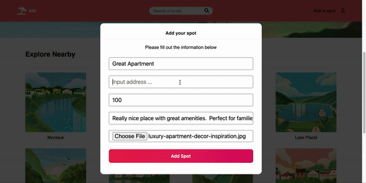

<h1 align="center">brb</h1>

<p align="center">See my site hosted on heroku
<br><a href="https://bnbair.herokuapp.com/">brb</a></br></p>
&nbsp

## Summary
brb is a web application inspired by Airbnb using React/Redux for the frontend, and express and sequelize on the backend. brb allows users to create an account and to browse and reserve spots for stays in New York.  The user searches by city and then browses the spots in that area.  The user then can select a spot and reserve it for a period of time. (Please see end for set-up)

<p>&nbsp;</p>

<p align="center">
  
</p>

## Overall Structure

---


### Backend

The app is built using Express. I used Sequelize as the ORM and postgreSQL for storing data.  All routes are RESTful and done using a JSON API


### Frontend
The font end is built using React.js and Redux.


### Libraries
brb uses:
 - [React.js](https://reactjs.org/)
 - [Redux](https://redux.js.org/)
 - [JavaSctipt](https://www.javascript.com/)
 - [BCrypt](https://pypi.org/project/bcrypt/) for authorization
 - [Express](https://expressjs.com/) for backend routes
 - [Sequelize](https://sequelize.org/) as the ORM for queries
 - [PostgreSQL](https://www.postgresql.org/) for data storage


## Wiki Documentation

---

- [Database Schema](https://github.com/sam-hearst/bnbair/wiki/Database-Schema)
- [MVP Features](https://github.com/sam-hearst/bnbair/wiki/Feature-List)
<p>&nbsp;</p>


## Key Technical Features

 ---


### Google Maps API and Google Places API

A key feature was the implementation of the google Places and google Maps API. When adding a spot, a user can search for any address that will autocomplete.  That information along with the latitude and longitude of the address is saved and appears as a marker on the map page.

<p>&nbsp;</p>

<p align="center">
  
</p>

## Obstacles

### Amazon Web Services Simple Storage Service (AWS S3)

One of the obstacles faced in the project was how to allow users to upload photos. I needed a more effective way to store image data rather than just saving the image url.  I was recommended AWS.  I looked online for tutorials and walkthroughs and found some great resources.  Ultimately, I was able to effectively implement AWS, which allows photos uploaded from a user's computer to be saved in the database.  When a user uploads a photo of a spot, the file is saved within my AWS bucket for this project.  The name of the file is then saved within the database making it very easy to retrieve and display.

```javascript
const imgUrl = await singlePublicFileUpload(req.file);
```

```javascript
const singlePublicFileUpload = async (file) => {
    const { originalname, mimetype, buffer } = await file;
    const path = require("path");
    // name of the file in your S3 bucket will be the date in ms plus the extension name
    const Key = new Date().getTime().toString() + path.extname(originalname);
    const uploadParams = {
        Bucket: NAME_OF_BUCKET,
        Key,
        Body: buffer,
        ACL: "public-read",
    };
    const result = await s3.upload(uploadParams).promise();

    // save the name of the file in your bucket as the key in your database to retrieve for later
    return result.Location;
};
```

---

## Getting Started


### Express React Project

1. Clone this repository (only this branch)

   ```bash
   git clone https://github.com/sam-hearst/bnbair.git
   ```

2. cd into frontend folder and run npm install and npm start

    ```bash
    cd frontend
    ```

    ```bash
    npm install
    ```

    ```bash
    npm start
    ```

3.  open new terminal and cd into backend folder

    ```bash
    cd backend
    ```

4.  Create .env file in backend and fill to look like .env.example (need AWS S3)

    ```
    PORT=
    DB_USERNAME=
    DB_PASSWORD=
    DB_DATABASE=
    DB_HOST=localhost
    JWT_SECRET=
    JWT_EXPIRES_IN=604800
    AWS_ACCESS_KEY_ID=
    AWS_SECRET_ACCESS_KEY=
    ```

5. Run npm install and npm start

    ```bash
    npm install
    ```

    ```bash
    npm start
    ```

6.  Navigate to localhost:3000
